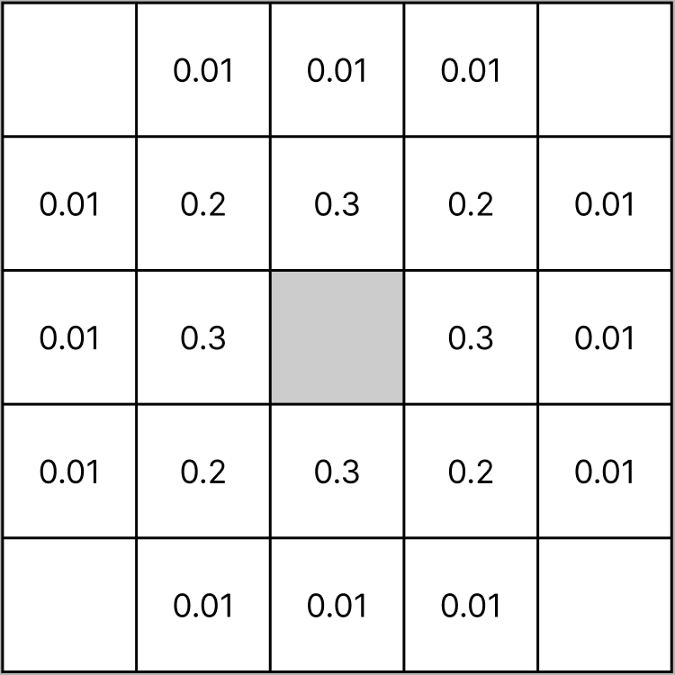
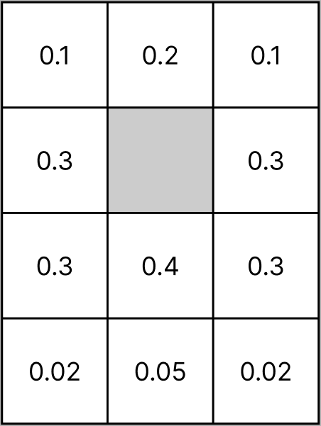
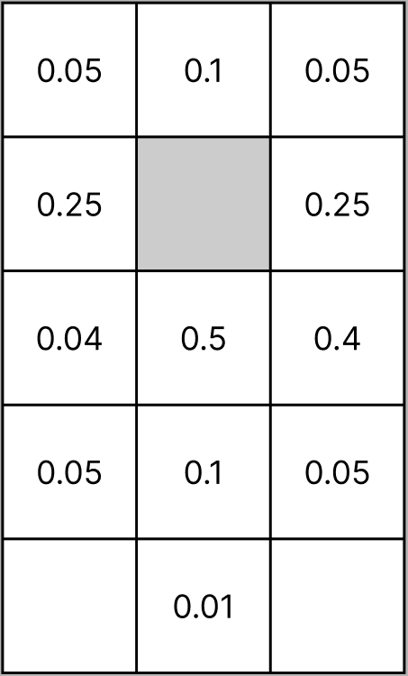
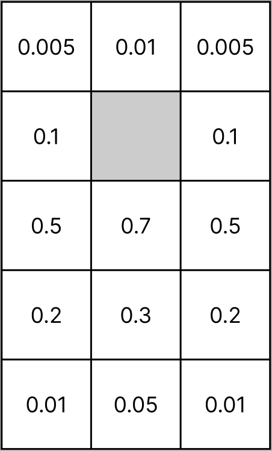

# Cahier des charges

## Version 1 : Propagation simple du feu et des brandons

- La forêt est représentée par une grille de cases rectangulaires.
- Chaque case peut être :
  - Inerte (vide de végétation, insensible au feu).
  - Couverte de végétation (inflammable).
  - Enflammée (brûle pendant 2 itérations).
  - Brûlée et chaude (peut encore envoyer des brandons).
  - Brûlée et froide (définitivement inerte).
- Initialement, deux cases sont enflammées.
- Une case enflammée reste en feu pendant 2 itérations. À la 3e itération, elle devient "brûlée et chaude".
- Une case "brûlée et chaude" peut envoyer des brandons avec une probabilité de 0.005.
- Une case "brûlée et chaude" peut devenir "brûlée et froide" avec une probabilité de 0.4 par itération, sinon elle reste "brûlée et chaude".
- Un brandon peut enflammer une case voisine si celle-ci contient de la végétation.

_La dispersion des brandons. La case grisée représente une case brûlée et chaude._

## Version 2 : Type de terrain

- Ajout de 4 types de terrains influençant la densité de végétation :
  1. Continue : toutes les cases sont couvertes de végétation.
  2. Peu espacée : 95% des cases sont couvertes de végétation (répartition aléatoire).
  3. Espacée : 80% des cases sont couvertes de végétation (répartition aléatoire).
  4. Clairsemée : 50% des cases sont couvertes de végétation (répartition aléatoire).
- Les cases inertes restent ininflammables.

## Version 3 : Humidité du sol

- Une case inflammable a un niveau d'humidité qui modifie la probabilité qu'un brandon l'enflamme :
  - Humide : 10% de chance de s’enflammer.
  - Normal : 30% de chance de s’enflammer.
  - Sec : 60% de chance de s’enflammer.
  - Très sec : 90% de chance de s’enflammer.

## Version 4 : Vent

- Ajout d’un facteur vent influençant la propagation des brandons :
  - Nul (force 0) : diffusion des brandons de manière isotrope selon un schéma prédéfini.
  - Modéré (force 1) : augmentation de la probabilité d’envoi des brandons dans la direction du vent.
  - Fort (force 2) : renforcement de l'effet du vent sur la propagation des brandons.
  - Violent (force 3) : forte amplification de la dispersion des brandons dans la direction du vent.
- Le vent vient uniquement du haut de la carte et reste constant durant toute la simulation.

_Dispersion des brandons avec un vent nul._

_Dispersion des brandons avec un vent modéré._

_Dispersion des brandons avec un vent fort._

_Dispersion des brandons avec un vent violent._

## Version 5 : Route et zones pare-feu

- Possibilité d’ajouter une route (ligne de cases inertes) traversant la forêt (horizontalement ou verticalement).
- La route bloque normalement le feu, sauf si des brandons parviennent à enflammer l’autre côté.
- Simulation de différentes largeurs de routes pour étudier leur efficacité comme pare-feu.
